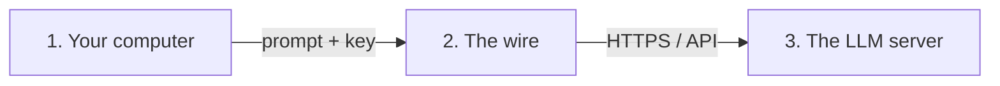
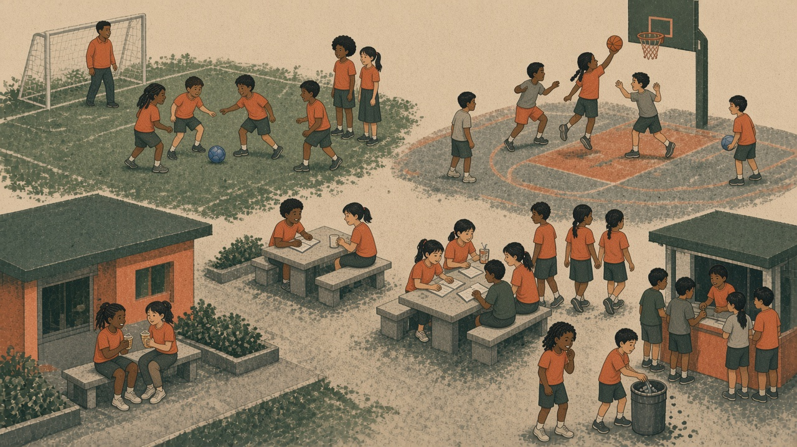
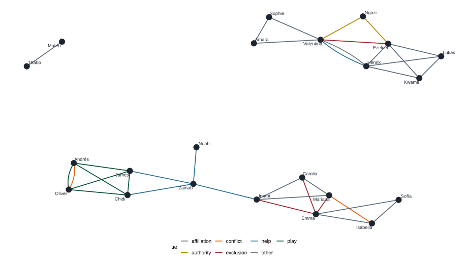
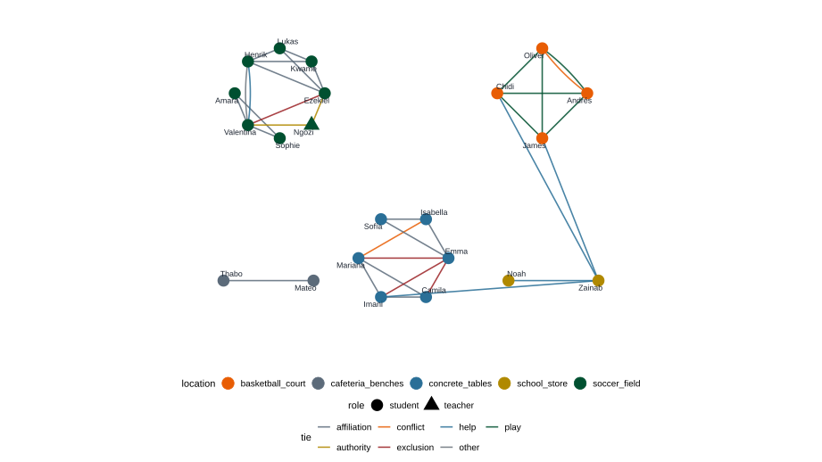

## From field notes to a database {.center background-color="#0f2a22"}


## Learning objective {.center}

Turn [one ethnographic observation]{.accent} into a [network]{.green} using schema-guided  
LLM outputs in R.

## Topics

- Programmatic AI as method
- Privacy, keys, untrusted text
- Schemas with `ellmer`
- A demo

# Why code, not only chat

## The point is not that AI can do everything

::: {.fragment}
It is that [you]{.accent} can do a lot with these tools,  
as long as you stay inside the [scientific method]{.green}.
:::

## We already have a method

::: {.fragment}
[Reproducible]{.green} steps when we can re-run the work,  
and [transparent methods]{.green} when we cannot.
:::

## You can do this in a chat window

::: {.fragment}
That is not the issue.

The question is whether [you]{.accent} keep making the work:  
traceable steps, visible procedures, and you in the creative loop.
:::

## What often goes wrong with chat alone

::: {.incremental}
- [You only copy and paste]{.accent}: the model thinks; you move text
- [A chat is not a method]{.accent}: a collaborator cannot open, run, or review it
- [Fluent is not true]{.accent}: plausible language is easy to trust
:::

## What code keeps in the loop

::: {.incremental}
- The prompt and the code live in files
- Another person (or future you) can re-run the workflow
- You design the table; the model fills it; you still have to check
- You are the latent variable
:::

## The stack

```mermaid
flowchart LR
  A[Your judgment] --> B[R / files]
  B --> C[ellmer] # I'll introduce this later
  C --> D[LLM API]
  D --> C
  C --> E[Auditable tables]
  E --> A
```

::: {.muted}
[ellmer.tidyverse.org](https://ellmer.tidyverse.org/)
:::

## From R, with a trail

```{r}
#| eval: false
library(ellmer)

chat <- chat_google_gemini()
chat$chat("What is a an ethnography?")
```

::: {.fragment .muted}
Same model as a chat UI. The difference is that this lives in a file.
:::

## Looks right is not enough {.center background-color="#0f2a22"}

## Fluent output is easy to trust

Models optimize for [plausible language]{.accent}.

::: {.fragment}
Xie et al. (2026, *PNAS*): even statistically realistic LLM data  
may not be true.  
<https://doi.org/10.1073/pnas.2538145123>
:::

::: {.fragment}
Outputs are material that still has to enter the method.
:::

# Security first

## Security first {.center background-color="#0f2a22"}

Before we send any text.

## Two different questions

:::: {.columns}
::: {.column width="50%"}
**Privacy**  
Who is [allowed]{.green} to see the data?

- Identifiable students
- Clinic or school records
- Consent and minimization
:::
::: {.column width="50%"}
**Security**  
Who can [steal, hijack, or break]{.accent} the system?

- Stolen keys
- Prompt injection
- Invented facts you then believe
:::
::::

::: {.fragment .muted}
Privacy rules keep protected text off the wire.  
They do **not** stop a model from being fooled.
:::

## Three places the data can leak



::: {.muted}
Once identifiable notes are on hop 2 or 3, you cannot pull them back.
:::

## Public APIs are someone else's computer

OpenAI, Anthropic, Google: [untrusted third parties]{.accent}  
unless your institution has a written agreement.

::: {.fragment}
Treat sending text as handing it over.
:::

::: {.fragment .muted}
Your campus rules still decide what may leave the machine.  
:::

## This key is a password

API keys are like passwords.

Anyone who has it can spend the account's credit and call the API [as you]{.accent}.

:::: {.columns}
::: {.column width="50%"}
**Never**

- Chat, email, WhatsApp
- GitHub or shared scripts
- Slides or screenshots
- `api_key = "sk-..."` in code
:::
::: {.column width="50%"}
**Today:** `~/.Renviron`  
One line on **your** laptop. Restart R after you save.

**Later:** `keyring`  
OS keychain. Stronger than a text file.
:::
::::

## Store the key

```{r}
#| eval: false
install.packages("usethis")
usethis::edit_r_environ()
```

Add **one** line, no quotes, no spaces around `=`:

```
GOOGLE_API_KEY=paste-the-value-here
ANTHROPIC_API_KEY=paste-the-value-here
OPENAI_API_KEY=paste-the-value-here
```

::: {.muted}
Today: Gemini. Save. **Restart R.** Confirm with `nzchar(Sys.getenv("GOOGLE_API_KEY"))` - do not print the secret.
:::

## What may travel with this key

:::: {.columns}
::: {.column width="50%"}
**Prefer**

- These field notes
- Public papers
- De-identified toys
:::
::: {.column width="50%"}
**Never**

- Real student names
- Identifiable interviews
- Clinic or school records
:::
::::

The key authenticates you. [Privacy still decides]{.green} what the request may contain.

## Three risks that matter today

:::: {.columns}
::: {.column width="33%"}
**Leak**  
Protected text or the key leaves your machine.
:::
::: {.column width="33%"}
**Injection**  
Untrusted notes the model is asked to *read* become new instructions.
:::
::: {.column width="33%"}
**Believe**  
Malicious text in the prompt fools the model. You still trust the output.
:::
::::

::: {.fragment .muted}
[OWASP GenAI LLM Top 10 (2026)](https://genai.owasp.org/resource/owasp-genai-llm-top-10-2026/): prompt injection, sensitive disclosure, misinformation.  
Defense is architectural: schema, audit, human check - not simply a nicer prompt.
:::

## Send only what you are willing to let go of {.center}

And assume the model can still get fooled.

# The ethnography

## The ethnography {.center background-color="#0f2a22"}

One recess. One courtyard. Notes, not a survey.

## Why start here

We are interested in peer effects.

Implementation and prevention work often begin as [unstructured text]{.accent}:

::: {.incremental}
- Recess and classroom observations
- Outreach notes
- Interview transcripts
:::

::: {.fragment}
A roster survey would ask “who is your friend?”  
These notes [show]{.green} who stands where, who is refused, who helps.
:::

## Recess courtyard notes {.ethno-slide .scrollable auto-stretch="false"}

Field notes. [No real students]{.green}. Scroll.

::: {.ethno-panel}
```{r}
#| echo: false
#| output: asis
#| message: false
library(tidyverse)

raw <- read_lines("school-obs.md")
start <- which(!str_detect(raw, "^\\s*#") & str_trim(raw) != "")[1]
cat(str_flatten(raw[start:length(raw)], "\n"))
```
:::

::: {.notes}
Three minutes. Let them scroll. Then ask: where did your eye go first? Soccer exclusion is the usual answer.
:::

## The courtyard at 9:47 {.nostretch}

{.nostretch fig-align="center"}

## Soccer field

Ezekiel comes out of the [fifth-grade]{.accent} hallway with Kwame, Lukas, and Henrik. Lukas has the ball. Ezekiel organizes teams.

::: {.fragment}
Amara, Valentina, and Sophie watch from the side.  
Valentina asks Henrik: [“Can we play?”]{.accent}
:::

::: {.fragment}
Ezekiel: [“We already started.”]{.accent}  
Then Ngozi, the PE teacher, makes them reorganize.
:::

## Basketball court

Andrés, Oliver, Chidi, and James are already playing.  
Andrés directs. Oliver ignores him. They argue whether a shot was out.

::: {.fragment}
The ball rolls away. [Chidi waits]{.green} with it.
:::

## Benches, tables, store

:::: {.columns}
::: {.column width="50%"}
Mateo and Thabo share cookies and [watch]{.accent}.  
They join no game.
:::
::: {.column width="50%"}
At the tables, a rule dispute - then Mariana, Imani, and Camila [leave]{.accent} when Emma returns with juice.
:::
::::

::: {.fragment}
Near the store, Zainab has lost a bill.  
Noah, [third grade]{.green}, finds it.
:::

## What we want from these notes

:::: {.columns}
::: {.column width="50%"}
- Who is tied to whom
- What kind of tie
- A quote that defends it
:::
::: {.column width="50%"}
- Who each person is
- Role, grade, place
- What they are doing there
:::
::::

# Structured extraction

## Chat replies are not networks

Ask: “Who is connected to whom?”

::: {.fragment}
You get a paragraph.
:::

::: {.incremental}
- Names drift (`Ezekiel` vs `the organizer` vs `he`)
- Tie labels drift (`friend` vs `close` vs `together`)
- Shared courtyard becomes a fake edge
- Hard to re-run the same extraction next week
:::

## Structured output = contract = constraint

You tell the LLM: return an object that matches [this shape]{.green}.  
`ellmer` converts that object into familiar R types (named lists, tibbles, an edge list).

## `type_*()` building blocks

| Helper | What it is |
|--------|------------|
| `type_boolean()` | `TRUE` / `FALSE` |
| `type_integer()` / `type_number()` | A number |
| `type_string()` | Text |
| `type_enum(c(...))` | One label from a closed list |
| `type_array(...)` | Many of the same shape (rows) |
| `type_object(...)` | Named fields (one row) |

::: {.fragment .muted}
Today: `type_object`, `type_string`, `type_enum`, `type_array`.
:::

## Load the data

```{r}
#| eval: false
library(tidyverse)

notes <- read_file("school-obs.md")
```

::: {.notes}
This is the import. Do not skip the human read. Timer on. Then the structured call.
:::

## The call that changes everything

```{r}
#| eval: false
library(ellmer)

tie <- type_object(
  person_from = type_string("Person at one end; canonical first name"),
  person_to = type_string("Person at the other end; canonical first name"),
  tie = type_enum(c(
    "affiliation",
    "play",
    "conflict",
    "exclusion",
    "help",
    "authority",
    "other"
  )),
  evidence_quote = type_string("Short supporting quote")
)

chat <- chat_google_gemini()
chat$chat_structured(
  notes,
  type = type_array(tie)
)
```

::: {.fragment}
Define shape → send the [loaded]{.green} text → get rows.
:::

## The prompt lives in a file

R code does not contain the prompt (prompt - text).  
It [reads]{.green} `prompts/extract_ties.md` and sends it.

```{r}
#| eval: false
prompt <- read_file("prompts/extract_ties.md")

chat$chat_structured(
  str_c(prompt, "\n\nObservation:\n", notes),
  type = type_array(tie)
)
```

::: {.fragment .muted}
Edit the `.md`. New `chat` object. Re-run. That is the method.
:::

## Descriptions steer the fields

The first argument of each `type_*()` is a [description]{.accent}.

```{r}
#| eval: false
type_string("Canonical first name; Amara is one person")
type_enum(
  c(
    "affiliation",
    "play",
    "conflict",
    "exclusion",
    "help",
    "authority",
    "other"
  ),
  "Best-fitting label; use other if the list does not fit"
)
```

::: {.fragment}
Descriptions are soft instructions. Test them like prompts.
:::

## Required fields invite invention

Default: `required = TRUE` → the model [tries hard]{.accent} to fill every field.

::: {.fragment}
If two children share a courtyard, you may get a confident fake friendship.
:::

## Prefer honest missingness

Can be empty: missing edges.

::: {.incremental}
- Do not extract a tie you cannot quote
- Shared recess ≠ tie
- `other` is better than a wrong closed label
:::

## Why `evidence_quote`?

Forces a [pointer back to the text]{.accent}.

::: {.fragment}
Makes disagreement discussable:  
“I labeled exclusion because of *this* sentence.”
:::

# Lab

## Lab {.center background-color="#0f2a22"}

**Extract one network. Then add attributes.**

## Packages and key

```{r}
#| eval: false
install.packages(c("tidyverse", "ellmer"))
```

Open R. Confirm the key without printing it.

```{r}
#| eval: false
nzchar(Sys.getenv("GOOGLE_API_KEY"))
```

::: {.muted}
Working directory: `UNILORIN-presentation/`
:::

## Guardrails during lab

::: {.incremental}
- These field notes only - [no real notes]{.accent}
- Keys stay out of the code
- Do not “fix” bad rows in chat follow-ups
- Change the schema or the `.md`, then a [new]{.green} call
:::

## Round 1 · Ties {.center background-color="#0f2a22"}

The edge list.

## Target schema (ties)

```{r}
#| eval: false
tie <- type_object(
  person_from = type_string("Person at one end; canonical first name"),
  person_to = type_string("Person at the other end; canonical first name"),
  tie = type_enum(c(
    "affiliation",
    "play",
    "conflict",
    "exclusion",
    "help",
    "authority",
    "other"
  )),
  evidence_quote = type_string("Short quote that supports this tie")
)
```

## What the labels mean

| Label | Use when the notes show |
|-------|-------------------------|
| `affiliation` | Arrive, sit, or walk together |
| `play` | Same game, same side |
| `conflict` | An argument in the text |
| `exclusion` | A refusal or a walk-away |
| `help` | Search, vest, recovered bill |
| `authority` | Teacher directs students |
| `other` | Explicit, but the list does not fit |

## Round 1 steps

::: {.incremental}
1. Confirm `notes` is loaded from `school-obs.md`
2. Extract ties
3. Pair: one drives, one audits [soccer]{.accent} first
:::

## Audit sheet

```
person_from -- person_to   tie          in text?  quote OK?
________________  __________   Y/N       Y/N
________________  __________   Y/N       Y/N
________________  __________   Y/N       Y/N

Invented edge: ________________
Missing edge:  ________________
```

## Round 2 · Node attributes {.center background-color="#0f2a22"}

The same people, now as a node table.

## Why nodes second

The edge list already named most people.

::: {.fragment}
Attributes are how a network becomes a [dataset]{.green}:  
role, grade, place, activity.
:::

::: {.fragment .muted}
You could have started here. Starting with ties makes the graph appear first.
:::

## Target schema (nodes)

```{r}
#| eval: false
person <- type_object(
  name = type_string("Canonical first name"),
  role = type_enum(c("student", "teacher", "other")),
  grade = type_string("Only if stated; else empty"),
  location = type_enum(c(
    "soccer_field",
    "basketball_court",
    "cafeteria_benches",
    "concrete_tables",
    "school_store",
    "other"
  )),
  activity = type_string("What they are doing there"),
  evidence_quote = type_string()
)
```

## Extract the node table

```{r}
#| eval: false
prompt <- read_file("prompts/extract_nodes.md")

chat <- chat_google_gemini()
nodes <- chat$chat_structured(
  str_c(prompt, "\n\nObservation:\n", notes),
  type = type_array(person)
)
```

::: {.fragment}
Same `notes`. New `chat`. Schema `person` instead of `tie`.
:::

## Traps in the node table

::: {.incremental}
- Grade is stated for [Ezekiel]{.green} (fifth) and [Noah]{.green} (third)
- Do not guess the rest are fifth grade
- Do not infer [gender]{.accent} from a name
- Ngozi is the only teacher in these notes
:::

## Round 2 steps

::: {.incremental}
1. Extract the node table
2. Count rows. About [22]{.accent} named people
3. Check grade: only two should be filled
4. Join: does every edge endpoint exist as a node?
:::

## Assemble {.center background-color="#0f2a22"}

Two tables. One network.

## Two tables

```
edges   person_from, person_to, tie, quote
nodes   name, role, grade, location, activity
```

## Plot with tidygraph

```{r}
#| eval: false
library(tidygraph)
library(ggraph)

net <- tbl_graph(
  nodes = nodes,
  edges = edges |>
    rename(from = person_from, to = person_to),
  directed = FALSE,
  node_key = "name"
)

ggraph(net, layout = "kk") +
  geom_edge_fan(aes(color = tie)) +
  geom_node_point(size = 5) +
  geom_node_text(aes(label = name), repel = TRUE)
```

## One network {.nostretch}

{.nostretch fig-align="center"}

## Add attributes

```{r}
#| eval: false
ggraph(net, layout = "kk") +
  geom_edge_fan(aes(color = tie)) +
  geom_node_point(
    aes(color = location, shape = role),
    size = 6
  ) +
  geom_node_text(aes(label = name), repel = TRUE)
```

::: {.muted}
Color is location. Triangle is the teacher. `images/network-by-location.svg`.
:::

## The courtyard as a graph {.nostretch}

{.nostretch fig-align="center"}


# Close

## What you should own now

::: {.incremental}
- Code as the place the method lives
- Schema are useful for replication and transparency 
- Database completed in layers: one network, then attributes
:::


## Closing line {.center background-color="#0f2a22"}

The ethnography is the evidence.  
The schema is the method.  
The model only [fills the table]{.accent}.

::: {.muted}
Francisco Cardozo, 
University of Miami, 
foc9@miami.edu · [https://focardozom.github.io/](https://focardozom.github.io/)
:::
